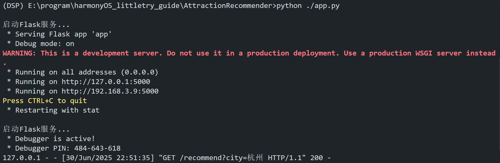
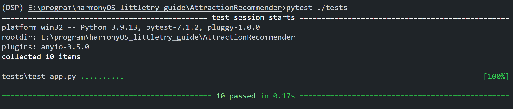

## 🏞 景点推荐系统接口文档（推荐服务模块）

### 📌 功能简介

本模块提供基于城市、地理位置和推荐数量的**景点智能推荐 API**。用户可以通过 GET 请求获取推荐的景点列表，系统会根据地理距离和评分进行排序筛选。

---

### 🔗 接口路径

```
GET /recommend
```

---

### 📥 请求参数

| 参数名    | 类型      | 是否必填 | 默认值        | 说明                   |
| ------ | ------- | ---- | ---------- | -------------------- |
| `city` | string  | 否    | 杭州         | 城市名称                 |
| `lat`  | float   | 否    | 30.314244  | 纬度（可选，辅助推荐）          |
| `lon`  | float   | 否    | 120.343229 | 经度（可选，辅助推荐）          |
| `n`    | integer | 否    | 10         | 推荐数量，必须是 1～50 之间的正整数 |

---

### ✅ 正确响应示例（状态码 200）

```json
{
  "nums": 10,
  "recommended_jingdians": [
    {
      "city": "杭州",
      "cover_image": "https://dimg04.c-ctrip.com/images/0101t12000f6tzhnu11A7.jpg",
      "description": "下沙大学生创意集市是由杭州经济技术开发区管委会发起，白杨街道和下沙网共同投资管理，大学生创业企业下沙网负责日常运营管理的公益项目。它2008年开始试营业，2010年被评为杭州市首批19家特色夜市之一。在这里你可以看到一群有创意、有热情的年轻人，他们将艺术灵感发挥在DIY手工作品上，通过他们的再创造将普通物件点缀得灵动而富有生气。进入集市你会感受到满满的活力，可以在这里淘一些有趣的小物件。",
      "distance_km": 1.67,
      "latitude": 30.315908,
      "longitude": 120.360549,
      "name": "下沙大学生夜市",
      "rating": 4.7,
      "score": 4.5454
    },
    {
      "city": "杭州",
      "cover_image": "https://dimg04.c-ctrip.com/images/0106b12000864ao0gE5B4.jpg",
      "description": "城市阳台位于钱江新城核心区，与杭州大剧院、国际会议中心等建筑相邻。G20峰会期间上演的灯光秀和音乐喷泉，使这里一跃成为杭州新晋的网红景点。美丽的现代化都市夜景吸引很多人前来休闲、观景、娱乐。这一带的高楼、道路都是新建的，有些上海陆家嘴的感觉。白天人们在这里散步，欣赏两岸的都市风光，傍晚不少当地市民在这里锻炼身体。到了晚上，绚丽的城市建筑灯光秀更是吸引眼球。此时，原本漆黑的高楼大厦化身巨幅屏幕，呈现出斑斓的映像。人们一边看一边拍照、录像，发出阵阵感叹和喝彩的声音。",
      "distance_km": 14.53,
      "latitude": 30.241795,
      "longitude": 120.217317,
      "name": "城市阳台",
      "rating": 4.8,
      "score": 3.5896
    }
    ...
  ]
}
```

---

### ⚠️ 异常响应

#### ❌ 城市不存在（状态码 400）

```json
{
  "error": "城市不存在",
  "message": "输入的城市名称错误或者该城市数据未被收集"
}
```

#### ❌ 参数错误（状态码 400）

```json
{
  "error": "参数错误",
  "message": "参数 n 必须是 1 到 50 之间的整数。"
}
```

#### ❌ 附近无推荐结果（状态码 404）

```json
{
  "message": "附近没有推荐的景点",
  "recommended_jingdians": []
}
```

---

### 🧠 算法说明

* 推荐结果会根据景点评分和与输入位置的距离进行打分排序；
* 所有评分低于 `0.5` 的景点将会被过滤掉，不进入推荐结果；
* 景点评分范围为 0.0 ～ 5.0。

---

### 🧪 测试覆盖

请参考 `tests/test_app.py`，测试覆盖以下情形：

* 合法城市、位置、n 参数的正常推荐流程；
* 城市名称错误；
* 经纬度或 n 参数非法；
* 位置附近无推荐景点。
### 运行截图

### 测试通过
